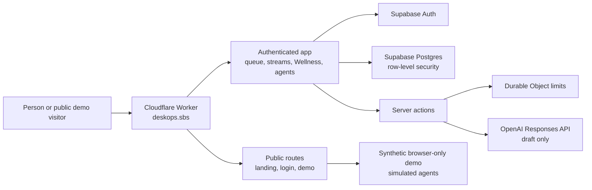

# DeskOps architecture

DeskOps is a private life-operations workspace. The queue is the source of truth for actionable work. Optional Wellness reflection and AI assistance can inform that work, but never write it without a person's decision.

## What each part owns

| Part | Responsibility |
| --- | --- |
| Public routes | Explain DeskOps, offer sign-in, and provide a synthetic, no-account walkthrough. |
| Supabase Auth | Authenticates a person through the enabled providers and returns them through the app callback. |
| Postgres with RLS | Stores each person's streams, tickets, and optional Wellness snapshots. Policies and foreign keys protect ownership boundaries. |
| Server actions | Validate user input and coordinate ticket, stream, Wellness, and draft workflows. |
| Durable Objects | Apply per-user and public-demo limits across Worker isolates. |
| OpenAI Responses API | Produces structured suggestions only. A person reviews, edits, adds, or dismisses every meaningful draft. |
| Public demo | Uses synthetic data and simulated tools. It has no shared account, personal workspace data, credentials, or live model-provider calls. |

## Core flows

### Sign-in and workspace

1. A person signs in through an enabled Supabase provider.
2. The authenticated app reads only rows owned by that person.
3. Streams provide comprehensible boundaries for tickets and future agent access.

### AI-assisted capture

1. A person describes a task in ordinary language.
2. DeskOps validates the request and applies an authenticated rate limit.
3. The model returns a structured draft with `store: false`.
4. The person can edit, add, or dismiss the result. Only the person's add action writes a ticket.

### Wellness and Rebalance

1. A person may record a private, optional Wellness snapshot and choose their own areas of focus.
2. DeskOps keeps untracked dimensions untracked, rather than treating them as zero.
3. Rebalance selects one tracked gap deterministically, then asks the model to draft one small, reviewable step.
4. The person decides whether that draft belongs in the queue.

## Deliberate boundaries

- DeskOps does not ask for repository, Gmail, Calendar, Drive, or other service access by default.
- The current public agents are simulated examples of a future provider-neutral, stream-scoped permission model. They cannot access an account or external tool.
- The public demo does not create an account or write to Supabase.
- Deployment targets, credentials, operational limits, and release runbooks are not published in this repository.

For local development and release commands, see the [README](../README.md). For the Build Week scope and evidence boundary, see [BUILD-WEEK.md](BUILD-WEEK.md).
